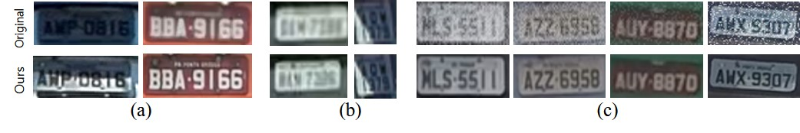
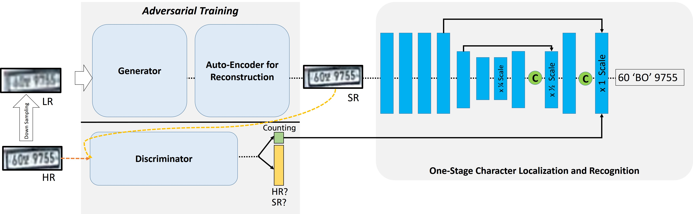
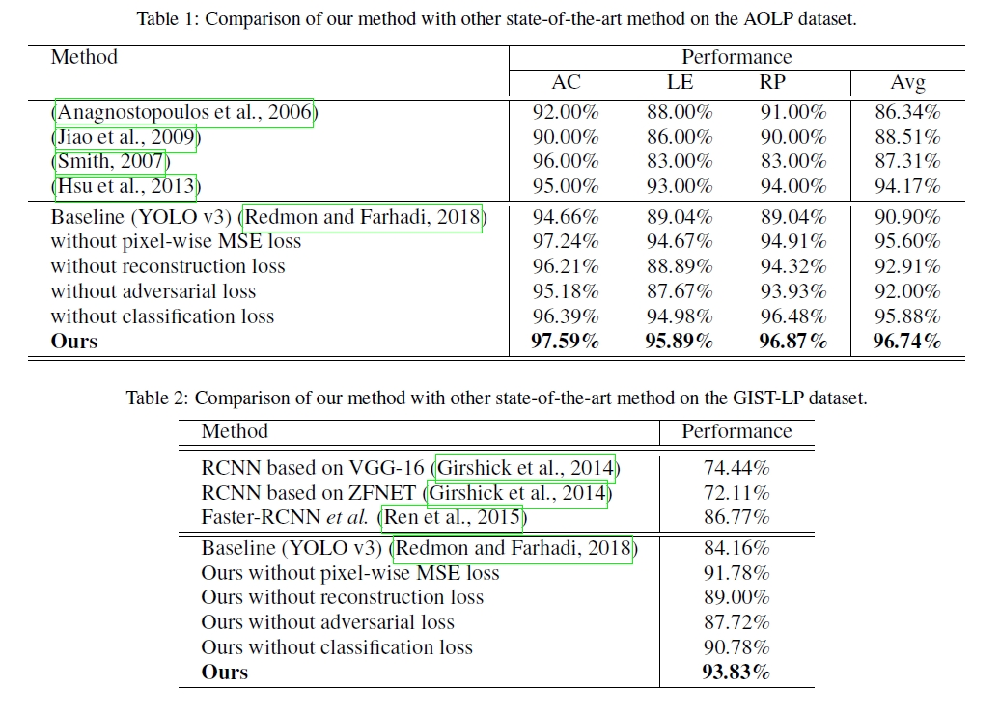
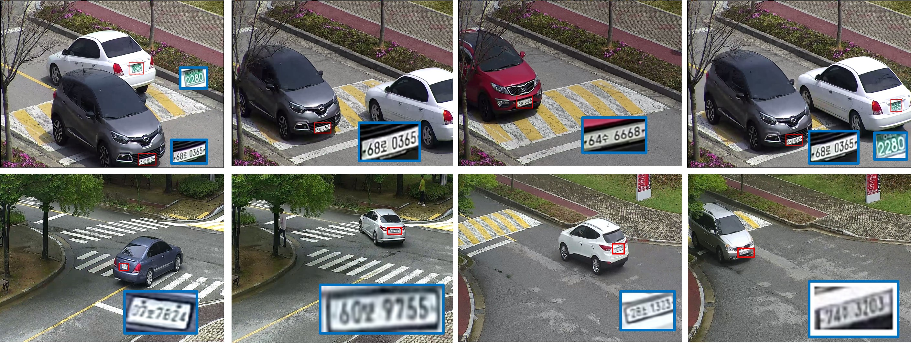

# Practical License Plate Recognition in Unconstrained Surveillance Systems with Adversarial Super-Resolution (VISAPP'19)
[[pdf](https://www.researchgate.net/publication/331783480_Practical_License_Plate_Recognition_in_Unconstrained_Surveillance_Systems_with_Adversarial_Super-Resolution)]

Younkwan Lee, Jiwon Jun, Yoojin Hong, Moongu Jeon; EECS, Gwangju Institute of Science and Technology (GIST)

# Abstract
Although most current license plate (LP) recognition applications have been significantly advanced, they arestill limited to ideal environments where training data are carefully annotated with constrained scenes.   Inthis paper,  we propose a novel license plate recognition method to handle unconstrained real world trafficscenes.   To  overcome  these  difficulties,  we  use  adversarial  super-resolution  (SR),  and  one-stage  charactersegmentation and recognition.  Combined with a deep convolutional network based on VGG-net, our methodprovides simple but reasonable training procedure. Moreover, we introduce GIST-LP, a challenging LP datasetwhere image samples are effectively collected from unconstrained surveillance scenes.  Experimental resultson AOLP and GIST-LP dataset illustrate that our method, without any scene-specific adaptation, outperformscurrent LP recognition approaches in accuracy and provides visual enhancement in our SR results that areeasier to understand than original data. 

<p align='center'></p>
<p align='center'></p>

# Requirements
   - python 3.5.2
   - opencv 3.4.2
   - numpy 1.14.3
   - argparse 1.1
   - tensorflow_gpu >=1.4.0 & < 2.0
   
# Results
## Example in GIST-LP Dataset
<p align='center'></p>
<p align='center'></p>

# References
[1] Ledig, Christian, et al. "Photo-realistic single image super-resolution using a generative adversarial network." Proceedings of the IEEE conference on computer vision and pattern recognition. 2017.

# Citation
**If you find the resource useful, please cite the following:**
```
   @article{lee2019practical,
  title={Practical License Plate Recognition in Unconstrained Surveillance Systems with Adversarial Super-Resolution},
  author={Lee, Younkwan and Jun, Jiwon and Hong, Yoojin and Jeon, Moongu},
  journal={arXiv preprint arXiv:1910.04324},
  year={2019}
   }
```

# References
   - [ Perceptual Losses for Real-Time Style Transfer and Super-Resolution] (https://link.springer.com/chapter/10.1007/978-3-319-46475-6_43)
   
# Contacts
   - Email : brightyoun@gist.ac.kr
